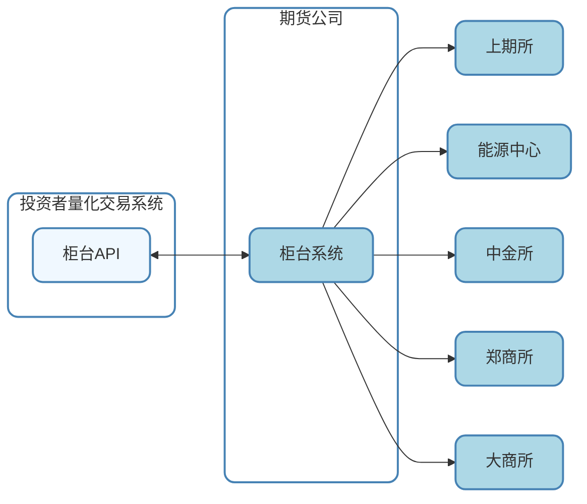
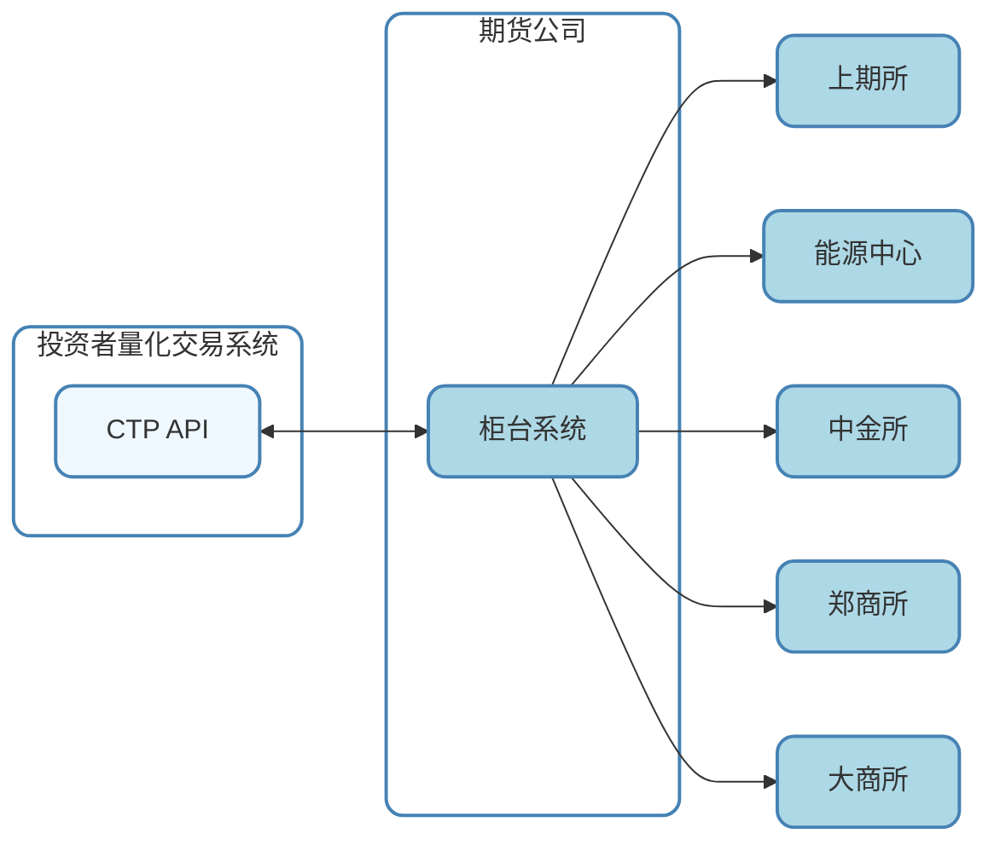

# CTP和CTP API的概念

## 一、前言

在上一篇文章《期货量化交易入门系列第一篇——程序化交易与量化交易的概念》中的程序化交易部分，我们在核心要素简单提到了CTP接口，本文接下来就是主要介绍期货量化交易的基础工具CTP和CTP API。

## 二、柜台系统

图1 程序化交易链路简图

---

依据国内监管要求，客户无法直连交易所系统，中间必须经过期货公司（Broker）的系统，这便是**柜台系统**。

期货公司会有多套柜台系统，在功能上可以分为主席和次席系统。主席系统功能全面，支持出入金，盘后结算等，讲究的是高吞吐量与高可靠性，一般客户都是在主席系统上交易。

例如CTP (*Comprehensive Transaction Platform, 综合交易平台*)即是上期所子公司上期技术开发的一套主席系统。

次席系统一般只做下单及撤单用，讲究的是低延迟穿透时间，一般为对时延要求较高的客户准备。

对于同时报出的相同订单，次席的单子会先到达交易所撮合。不过报单如何最快地到达交易所是由很多因素所决定的，穿透时间的测试也有很多学问，后面我会单独分享一系列低延迟交易系统研究。

柜台系统一般都会提供API（*Application Programming Interface，应用程序编程接口*）给程序化客户接入柜台使用。

## 三、CTP 是什么？

### 1. 基本定义

CTP（Comprehensive Transaction Platform）是上海期货交易所（SHFE）下属的子公司上海期货信息技术有限公司（SFIT），简称上期技术，自主研发的期货/期权综合交易平台。官网是https://www.shfe.com.cn/sfit/，它是中国期货市场最核心的交易系统，支持期货公司、投资者、做市商等机构接入交易所进行交易、行情获取和风险控制。

### 2. 核心功能

交易功能：报单、撤单、成交回报、持仓查询等。

行情服务：实时推送市场行情数据（如Tick级报价、盘口深度）。

风险管理：保证金计算、强平机制、交易权限控制。

结算支持：日终结算数据对接。

### 3. 适用市场

最初服务于上海期货交易所（SHFE），后扩展至：上海国际能源交易中心（INE）、中国金融期货交易所（CFFEX）、郑州商品交易所、大连商品交易所、广州商品交易所等商品期货交易所。

## 四、CTP API 是什么？

### 1. 定义

CTP API 是 CTP 平台对外提供的 应用程序编程接口（Application Programming Interface）。它允许开发者通过编程方式直接连接期货交易所的交易和行情系统，实现自动化交易、数据获取等功能。

### 2. 核心组成

CTP API 分为两个独立接口：

交易接口（Trade API）

功能：报单、撤单、查询账户、持仓、成交等。

协议：基于TCP/IP的私有协议（FTD协议）。

认证：需期货公司授权（经纪商编码、用户账号、密码等）。

行情接口（Market Data API）

功能：订阅实时行情（如最新价、买卖盘口、成交量）。

数据频率：支持Tick级（每秒多次更新）和快照数据。

费用：部分交易所对行情接口收费（如Level2深度数据）。

### 3. 技术特点

语言支持：官方提供 C++ 接口，社区封装了Python/Java/C#等版本。

低延迟：优化网络传输和协议解析，适用于高频交易。

异步通信：基于事件驱动模型（回调函数机制）。

## 五、CTP API 的架构与流程

1. 系统架构

2. 典型交互流程

   登录认证：通过期货公司前置机IP/端口连接，验证账号和密码。

   行情订阅：发送合约代码列表，接收实时行情推送。

   交易指令：程序生成信号 → 调用[ReqOrderInsert()]发送报单请求。

   交易所返回报单确认[OnRspOrderInsert()]。

   成交回报通过[OnRtnTrade()]回调通知。

   风控与结算：实时接收保证金、持仓变动数据。

## 六、CTP API 的开发与应用

### 1. 开发流程

- 环境准备：

  下载CTP API开发包（.dll/.so库文件 + 头文件）。

- 代码实现：

  配置网络连接（前置机地址、端口）。

  初始化API实例（CThostFtdcTraderApi::CreateFtdcTraderApi()）。

  注册回调函数（处理登录响应、订单回报等）。

  实现业务逻辑（如趋势跟踪策略的报单条件）。

- 测试与部署：

  使用模拟盘（SimNow）测试，官网是：https://www.simnow.com.cn

  生产环境接入期货公司实盘系统。

### 2. 常用工具与库

官方工具：**SimNow**提供的API开发包（版本如CTP 6.7.11）。

测试环境：**SimNow**仿真系统（免费模拟交易，属于上期技术公司旗下）。

### 3. 典型应用场景

高频交易：利用CTP API的低延迟特性进行套利。

量化策略执行：将回测策略转化为API的自动化交易。

做市商系统：自动报价维护市场流动性。

风控系统：实时监控保证金比例并触发强平。

## 七、CTP API 的优势与挑战

### 1. 优势

低延迟：直达交易所，减少中间环节。

稳定性：多年实盘验证，适合机构级应用。

功能全面：覆盖交易、行情、风控全流程。

### 2. 挑战

开发复杂度：需处理异步回调、线程安全等问题。

维护成本：交易所协议升级需同步更新代码。

合规要求：需通过期货公司接入，个人投资者权限有限。

## 八、与其它API的对比

| 特性       | CTP API          | 其他期货API（如飞马、易盛）  |
| ---------- | ---------------- | ---------------------------- |
| 所属交易所 | 上期所主导       | 多交易所兼容                 |
| 延迟       | 极低（微秒级）   | 较高（依赖封装层）           |
| 使用范围   | 中国境内期货市场 | 可能支持境外市场（如芝商所） |
| 开发者生态 | 社区支持丰富     | 相对封闭                     |

## 九、学习资源与建议

官方文档：SimNow发布的chm格式的CTP API开发手册。

开源项目：例如vnpy

实践步骤：从SimNow模拟交易开始，熟悉API调用流程。逐步实现简单策略（如均线突破）。关注异常处理（如断线重连、订单状态同步）。

## 十、总结

CTP API是中国期货市场程序化交易的基石，为开发者提供了直接连接交易所的核心工具。掌握CTP API不仅需要理解其技术实现，还需熟悉期货交易规则和风险管理逻辑。对于量化 交易者而言，它是实现策略自动化落地的关键桥梁。

---

*Last updated: 2026-03-09*